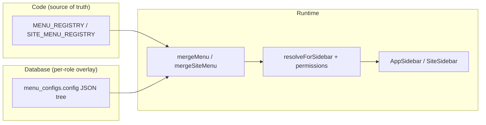

# Menu editor architecture

How the proxemacr menu editor, sidebar navigation, translations, and dedicated settings pages work — useful when replicating the pattern in another project.

## Architecture at a glance

The system uses a **three-layer** pattern:



| Layer | Responsibility |
|--------|----------------|
| **Registry** | Stable item IDs, default labels/icons, `href`/`path`, permissions, default groups |
| **DB config** | Per-role (and optionally per-site) overrides: label, icon, order, groups, hidden, `displayMode` |
| **Merge + resolve** | Merge DB with registry, drop removed routes, add new ones, filter by permission |

---

## Key files

| File | Role |
|------|------|
| `src/lib/menu-registry.ts` | `MENU_REGISTRY`, `SITE_MENU_REGISTRY`, `ICON_MAP`, defaults |
| `src/lib/menu-merge.ts` | `mergeMenu`, `resolveForSidebar`, `buildDefaultTree`, site variants |
| `src/services/menuConfigService.ts` | Supabase CRUD for `menu_configs` |
| `src/pages/settings/menu-editor.tsx` | Dedicated menu editor UI |
| `src/pages/settings/translations.tsx` | Translations hub (JSON download / coverage) |
| `src/components/layout/SettingsLayout.tsx` | Links to menu editor & translations |
| `src/components/layout/AppSidebar.tsx` | Global sidebar — loads & renders merged menu |
| `src/components/layout/SiteSidebar.tsx` | Per-store sidebar |
| `src/components/menu-editor/IconPicker.tsx` | Icon picker in editor |
| `public/locales/{locale}/settings.json` | Menu editor page strings (`menuEditor.*`) |
| `public/locales/{locale}/common.json` | Sidebar nav strings (`nav.*`, `appNavGroups.*`) |
| `next-i18next.config.js` | i18n locales and paths |

---

## 1. Code registry (`src/lib/menu-registry.ts`)

Every navigable route is registered once:

```ts
export type MenuRegistryItem = {
  id: string;
  defaultLabel: string;
  defaultIcon: string;
  href: string;
  defaultGroup: string;
  defaultOrder: number;
  permission?: Permission;
  superAdminOnly?: boolean;
};
```

- **`MENU_REGISTRY`** — global app sidebar (`/clients`, `/billing`, …)
- **`SITE_MENU_REGISTRY`** — per-store sidebar (`/sites/:id/orders`, …)
- **`ICON_MAP` / `resolveIcon`** — Lucide icons by string name (editor + sidebar)

**Convention:** When adding a new top-level route under `src/pages/` (not under `src/pages/sites/`), add a matching row to `MENU_REGISTRY` in `src/lib/menu-registry.ts`: `href`, label, icon (must exist on `ICON_MAP`), default group/order, and `superAdminOnly` or `permission` to match the page guard. Store/scoped routes go in `SITE_MENU_REGISTRY` only.

---

## 2. Database (`menu_configs`)

### Migrations

Only two SQL migrations reference `menu_configs`:

1. **`supabase/migrations/20260418115323_migration_ebd4bfb6.sql`** — creates the table (originally `role` as primary key, JSONB `config`, RLS).
2. **`supabase/migrations/20260423120000_menu_configs_schema_sync.sql`** — adds `id`, `scope`, `site_id`, swaps PK to `id`, adds unique indexes for global vs site rows.

### Original table (simplified)

```sql
CREATE TABLE IF NOT EXISTS menu_configs (
  role TEXT PRIMARY KEY,
  config JSONB NOT NULL DEFAULT '[]'::jsonb,
  updated_at TIMESTAMPTZ DEFAULT NOW(),
  updated_by UUID REFERENCES auth.users(id) ON DELETE SET NULL
);
-- RLS: authenticated read; super_admin write
```

### Current shape (after schema sync)

| Column | Purpose |
|--------|---------|
| `id` | UUID primary key |
| `role` | e.g. `super_admin`, `admin`, `user` |
| `scope` | `global` or `site` |
| `site_id` | `null` for global; store UUID for site-scoped menus |
| `config` | `MenuNode[]` JSON tree |
| `updated_at`, `updated_by` | Audit |

Unique constraints:

- Global: one row per `role` where `scope = 'global'` and `site_id IS NULL`
- Site: one row per `(role, site_id)` where `scope = 'site'`

### `MenuNode` shape (`src/services/menuConfigService.ts`)

- **item**: `id`, `label`, `icon`, `hidden?`, `iconColor?`
- **group**: same + `children[]`, optional `displayMode: "inline" | "panel"`

CRUD uses the Supabase client directly (`getMenuConfig`, `saveMenuConfig`, `resetMenuConfig`, plus `getSiteMenuConfig` / `saveSiteMenuConfig` / `resetSiteMenuConfig`) — no separate REST API for the editor.

---

## 3. Merge logic (`src/lib/menu-merge.ts`)

Important behaviors:

1. **`buildDefaultTree()`** — builds the default tree from `MENU_REGISTRY` + `DEFAULT_GROUPS`.
2. **`mergeMenu(config)`** — if DB is empty, uses defaults; prunes items no longer in registry; puts new registry items in an **“Unassigned (new)”** group.
3. **`resolveForSidebar(tree, can, isSuperAdmin)`** — applies `hidden`, `permission`, `superAdminOnly`, and billing lock rules; attaches real `href` from registry (labels/icons come from DB).

Site menus mirror this with `mergeSiteMenu` / `resolveForSiteSidebar` (paths become `/sites/{siteId}/…`).

**Billing lock:** When billing is enforced and the subscription has no access, non–super-admins only see a allow-listed set of menu item IDs (billing, settings, admin tools, etc.) — see `BILLING_LOCKED_ALLOWED_IDS` in `menu-merge.ts`.

---

## 4. Dedicated Menu Editor page

| | |
|--|--|
| **Route** | `/settings/menu-editor` |
| **File** | `src/pages/settings/menu-editor.tsx` |
| **Access** | `AuthGuard requireSuperAdmin` |
| **Layout** | `SettingsLayout` (settings left nav + `AppLayout` shell) |

### How it is linked

Hardcoded in the settings hub nav (not in `MENU_REGISTRY`):

```tsx
// src/components/layout/SettingsLayout.tsx (admin group)
{ href: "/settings/menu-editor", icon: ListTree, label: t("settings.items.menuEditor"), show: isSuperAdmin },
{ href: "/settings/translations", icon: Languages, label: t("settings.items.translations"), show: isSuperAdmin },
```

### Editor flow

1. Load roles → tab per role (`listRoles` from `userService`).
2. `getMenuConfig(role)` → `mergeMenu(cfg)` → **flatten** tree to `FlatRow[]` + `OrderEntry[]` (easier UI).
3. User edits: labels, icons (`IconPicker`), group assignment, visibility, reorder, add custom groups (`group-custom-{timestamp}`).
4. **Save:** `rebuildTree(rows, groups, order)` → `saveMenuConfig(role, tree)`.
5. Clear sidebar cache key and dispatch `menu-config-updated` custom event (see implementation notes below).

### UI capabilities

- Per-role tabs
- Top-level items and grouped items
- Move items within group or reorder groups/items at top level
- Hide/show items; reset row to registry defaults
- Custom groups: add/rename/delete (delete only for `group-custom-*` ids)
- Group **display mode**: `inline` (expand below) vs `panel` (second sidebar column)

### Site menu editor

There is **no separate site menu editor page** in this repo — only the **global** editor at `/settings/menu-editor`. Site menus still support DB overrides via `getSiteMenuConfig` / `saveSiteMenuConfig`, but the admin UI for that is global-only today.

---

## 5. Sidebar consumption

### `AppSidebar.tsx` (global)

On load (per role key: `super_admin` | `admin` | `user`):

1. Try **localStorage** cache: `sidebar-menu-cache:v3:{role}`.
2. Fetch `getMenuConfig(roleKey)`.
3. `mergeMenu` → `resolveForSidebar` (permissions, billing lock).
4. Render groups as **inline** or **panel** (`displayMode`).

Special case: `group-stores` injects live site list under “Projects” (not stored in `menu_configs`).

Caches in memory (`cachedMenuByRole`) and localStorage; cleared on user change via `authCleanupCallbacks`.

### `SiteSidebar.tsx` (per store)

Same pattern with `getSiteMenuConfig(roleKey, siteId)`, `mergeSiteMenu`, `resolveForSiteSidebar`. Cache key: `{roleKey}:{siteId}`.

---

## 6. Translations

Two related systems: **editor page UI** vs **sidebar labels** vs **translations hub**.

### A. Menu Editor page UI (`settings` namespace)

The editor page loads i18n on the server:

```ts
export const getServerSideProps: GetServerSideProps = async ({ locale }) => ({
  props: {
    ...(await serverSideTranslations(locale ?? "en", ["common", "settings"])),
  },
});
```

Strings live under `menuEditor.*` in `public/locales/{locale}/settings.json` (title, save, reset, panel/inline, etc.).

Example keys (`public/locales/en/settings.json`):

- `menuEditor.title`, `menuEditor.subtitle`
- `menuEditor.save`, `menuEditor.saved`, `menuEditor.resetAll`
- `menuEditor.panel`, `menuEditor.inline`, `menuEditor.noGroup`
- …

### B. Sidebar item labels (runtime overlay)

DB stores customizable labels, but the sidebar **prefers locale files** when it knows the item id.

**App sidebar** (`AppSidebar.tsx`):

```ts
const APP_NAV_KEY_BY_ID: Record<string, string> = {
  dashboard: "health",
  clients: "clients",
  sites: "projects",
  // ...
};

const tItemLabel = (node: ResolvedMenuNode) => {
  const navKey = APP_NAV_KEY_BY_ID[node.id];
  if (navKey) return t(`nav.${navKey}`, { defaultValue: node.label });
  return t(`appNav.${node.id}`, { defaultValue: node.label });
};

const tGroupLabel = (node: ResolvedMenuNode) =>
  t(`appNavGroups.${node.label}`, { defaultValue: node.label });
```

- Item labels → `public/locales/{locale}/common.json` → `nav.*`
- Group labels → `appNavGroups.{English group name}` (e.g. `"Stores": "Stores"`)
- Unknown ids fall back to DB `node.label` via i18next `defaultValue`

**Site sidebar** (`SiteSidebar.tsx`): maps URL section to `nav.*` (e.g. `orders` → `nav.orders`, `settings` → `nav.configuration`).

So: **menu editor changes labels in DB**, but **i18n can still override** known keys at display time.

### C. Translations admin page (separate feature)

| | |
|--|--|
| **Route** | `/settings/translations` |
| **File** | `src/pages/settings/translations.tsx` |
| **Access** | `SettingsLayout requireSuperAdmin` |

This is **not** an in-app string editor for menus. It:

- Scans `public/locales/{locale}/{namespace}.json`
- Shows coverage vs English (missing/extra keys)
- Lets super admins **download** English JSON for offline translation

Workflow (`settings.translations.*` in `settings.json`): English is source of truth → download namespace → translate values (keep keys) → place at `public/locales/{locale}/{namespace}.json` → reload.

### i18n stack

- **Library:** [next-i18next](https://github.com/i18next/next-i18next)
- **Config:** `next-i18next.config.js` — 10 locales, `localePath: ./public/locales`
- **App:** `appWithTranslation` in `src/pages/_app.tsx`
- **Namespaces:** `common`, `auth`, `site`, `pricing`, `billing`, `admin`, `settings`, `referrals` (`src/lib/i18n.ts`)
- **Per page:** `serverSideTranslations` / `getStaticProps` declares which namespaces to load
- **User locale:** profile + `NEXT_LOCALE` cookie; language switcher in sidebar user menu

---

## 7. Replication checklist (another project)

1. **Registry file** — stable `id`, defaults, routes, permissions, icon names.
2. **`menu_configs` table** — JSON tree + `role` + optional `scope` / `site_id`; RLS for read/write.
3. **Service layer** — get / save / reset config.
4. **Merge + resolve** — registry ⊕ DB ⊕ auth (and product rules like billing lock if needed).
5. **Editor page** — flatten ↔ tree, role tabs, save/reset; super-admin guard.
6. **Settings nav entry** — link to `/settings/menu-editor`.
7. **Sidebar component** — load merged tree; optional localStorage cache; map ids → i18n keys.
8. **Translations** — `settings` namespace for editor UI; `common.nav` / `appNavGroups` for sidebar; optional translations hub for JSON files.
9. **New routes** — always register in `MENU_REGISTRY` (or site registry) before they appear in the editor.

---

## 8. Implementation notes

### Cache invalidation after save

On save, the editor runs:

```ts
localStorage.removeItem(`sidebar-menu-cache:${role}`);
window.dispatchEvent(new CustomEvent("menu-config-updated", { detail: { role } }));
```

`AppSidebar` caches under **`sidebar-menu-cache:v3:${role}`** (different key). Cache bust may be incomplete until refresh unless you align keys or listen for `menu-config-updated` and reload the menu.

### Custom event listener

`menu-config-updated` is dispatched on save from `menu-editor.tsx` only. As of the last repo scan, **no listener** exists in `src/` — the sidebar will not react to this event until you add one (e.g. in `AppSidebar`) or fix cache key alignment.

### Editor cannot invent routes

New routes must be added to `MENU_REGISTRY` / `SITE_MENU_REGISTRY` first. The editor only rearranges, relabels, hides, and groups **registered** items.

### Layout convention

Pages under `/admin/*` should use `AppLayout` only — not `SettingsLayout` — so inline panel submenus stay the only secondary nav (see comment in `menu-registry.ts`).

---

## Related AGENTS.md rule

From project `AGENTS.md`:

> When adding a new **top-level** route under `src/pages/` (anything **not** under `src/pages/sites/`), add a matching row to **`MENU_REGISTRY`** in `src/lib/menu-registry.ts`: `href`, label, icon (must exist on `ICON_MAP`), default group/order, and **`superAdminOnly`** or **`permission`** to match the page guard. Store/scoped routes stay in **`SITE_MENU_REGISTRY`** only.
